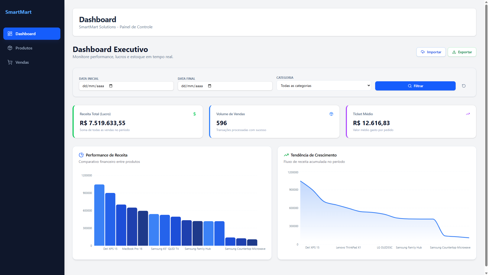

# 🛒 SmartMart Solutions - Fullstack Challenge

Este projeto é uma plataforma completa para gestão e análise de vendas. A solução integra um ecossistema robusto com **Django REST Framework** no backend e uma interface moderna e responsiva em **React (Vite)** com **Tailwind CSS** e **Shadcn/UI**.

---

## 🚀 Demonstração (Deploy)
- **Frontend:** https://smartmart-solutions.vercel.app/
- **Backend API:** https://smartmart-solutions.onrender.com/

### 📸 Screenshots
| Dashboard Principal | Gestão de Produtos |
|---|---|
|  |  |

---

## 🛠️ Tecnologias Utilizadas

### Frontend
- **React + Vite** (Fast Refresh e Build otimizado)
- **Tailwind CSS** (Estilização utilitária)
- **Shadcn/UI** (Componentes de alta qualidade)
- **Recharts** (Gráficos dinâmicos de performance)
- **Lucide React** (Iconografia moderna)
- **Sonner** (Notificações Toast profissionais)

### Backend
- **Django & DRF** (API REST robusta)
- **SQLite** (Desenvolvimento) / **PostgreSQL** (Produção)
- **WhiteNoise** (Gestão de arquivos estáticos em produção)
- **CORS Headers** (Segurança na comunicação entre domínios)

---

## 📂 Estrutura do Repositório
- `/backend`: API REST, Modelagem de dados e scripts de importação.
- `/frontend`: Aplicação SPA com Dashboards e CRUDs.
- `/data`: Datasets em CSV para carga inicial do sistema.

---

## ⚙️ Como Executar Localmente

### 1. Backend (Django)
```bash
# Entre na pasta
cd backend

# Crie e ative o ambiente virtual
python -m venv venv
source venv/bin/activate  # Linux/Mac
.\venv\Scripts\activate   # Windows

# Instale as dependências
pip install -r requirements.txt

# Execute as migrações e importe os dados iniciais
python manage.py migrate
python manage.py import_data

# Inicie o servidor
python manage.py runserver
2. Frontend (React)
Bash

# Entre na pasta
cd frontend

# Instale as dependências
npm install

# Inicie em modo de desenvolvimento
npm run dev
📡 Funcionalidades Principais
Dashboard Inteligente: Gráficos de barras com filtros por intervalo de datas e métricas automáticas (Receita, Ticket Médio, Transações).

CRUD de Produtos: Gerenciamento completo (Criar, Listar, Editar e Excluir) com feedback visual via Toasts.

Registro de Vendas: Interface intuitiva para registro de novas transações com cálculo automático de preços.

Responsividade Total: Interface adaptada para Desktop, Tablets e Dispositivos Móveis.

Importação Automatizada: Script para popular o banco de dados a partir de arquivos CSV legados.

📡 Endpoints da API
GET /api/products/ - Lista todos os produtos.

POST /api/products/ - Cria um novo produto.

PUT /api/products/<id>/ - Atualiza um produto.

DELETE /api/products/<id>/ - Remove um produto.

GET /api/categories/ - Lista as categorias.

GET /api/analysis/?start_date=YYYY-MM-DD&end_date=YYYY-MM-DD - Dashboard filtrável.

👨‍💻 Desenvolvedor
Kauã Torres França LinkedIn | Portfolio